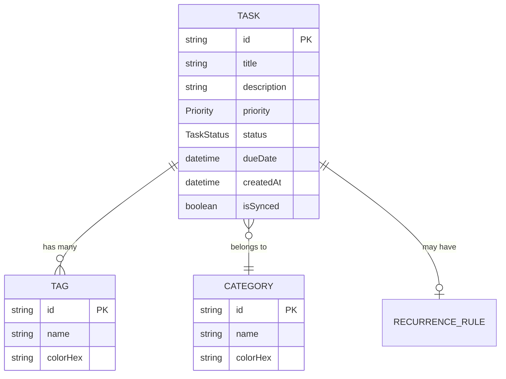
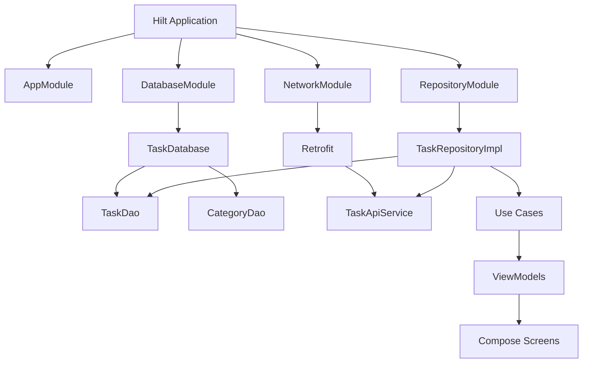

# 🚀 Taskora Android — Full-Stack Learning Roadmap

> **Your goal:** Build a production-quality Task Management Android app step-by-step.
> Each **Mini-Project** teaches you a focused set of concepts. Complete them in order — by the end, you'll have the full **Taskora** app.

---

## 🗺️ Roadmap at a Glance

```mermaid
graph LR
    MP1["1 · Project Setup\n& Theme"] --> MP2["2 · Domain\nModels"]
    MP2 --> MP3["3 · Room\nDatabase"]
    MP3 --> MP4["4 · Splash &\nNavigation"]
    MP4 --> MP5["5 · Auth\nScreens"]
    MP5 --> MP6["6 · Home Screen\n& Task List"]
    MP6 --> MP7["7 · Add / Edit\nTask"]
    MP7 --> MP8["8 · Hilt\nDI"]
    MP8 --> MP9["9 · Repository &\nUse Cases"]
    MP9 --> MP10["10 · Retrofit\nAPI"]
    MP10 --> MP11["11 · Calendar &\nAnalytics"]
    MP11 --> MP12["12 · Settings &\nPreferences"]
    MP12 --> MP13["13 · Workers &\nNotifications"]
    MP13 --> MP14["14 · Sync &\nPolish"]
```

| #   | Mini-Project              | Key Concepts                                  | Est. Time |
| --- | ------------------------- | --------------------------------------------- | --------- |
| 1   | Project Setup & Theme     | Gradle, Compose, Application class            | 1 day     |
| 2   | Domain Models             | Data classes, Enums, Clean Architecture       | 0.5 day   |
| 3   | Room Database             | Room, Entity, DAO, TypeConverters             | 1–2 days  |
| 4   | Splash & Navigation       | Jetpack Compose Navigation, Routes            | 1 day     |
| 5   | Auth Screens (UI only)    | Compose Forms, State, ViewModel               | 1–2 days  |
| 6   | Home Screen & Task List   | LazyColumn, State hoisting, Components        | 2 days    |
| 7   | Add / Edit Task Screen    | Forms, DatePicker, Validation                 | 1–2 days  |
| 8   | Hilt Dependency Injection | Hilt modules, @Inject, Scopes                 | 1 day     |
| 9   | Repository & Use Cases    | Repository pattern, UseCases, Flow            | 1–2 days  |
| 10  | Retrofit & Remote API     | Retrofit, OkHttp, Interceptors, DTOs          | 1–2 days  |
| 11  | Calendar & Analytics      | Custom Compose UI, Charts, Date logic         | 2 days    |
| 12  | Settings & Preferences    | DataStore, Theme switching                    | 1 day     |
| 13  | Workers & Notifications   | WorkManager, NotificationCompat, AlarmManager | 1–2 days  |
| 14  | Sync & Final Polish       | Offline-first, SyncWorker, Testing            | 2 days    |

> **Total estimated time: 16–22 days** (going at a learning pace)

---

## 📋 Prerequisites & What You Should Know Before Starting

Before you dive in, make sure you have a basic grasp of:

1. **Kotlin fundamentals** — variables, functions, classes, nullability, lambdas, coroutines basics
2. **Android basics** — what an Activity is, what the Manifest does, XML vs Compose (we'll use Compose)
3. **Android Studio** — how to create a project, run on emulator/device, use Logcat

> [!TIP]
> If you're shaky on Kotlin, spend 2–3 days on the [Kotlin Koans](https://kotlinlang.org/docs/koans.html) first. It's worth it.

---

## Mini-Project 1 · Project Setup & Theming

### 🎯 Goal
Set up the Taskora Android project from scratch with all necessary dependencies, configure Gradle properly, and create a beautiful Material 3 theme with Jetpack Compose.

### 📚 Concepts You'll Learn
- How Android Gradle build system works (project-level vs app-level)
- What `settings.gradle.kts` and `gradle.properties` do
- How to add dependencies (Compose, Room, Hilt, Retrofit, etc.)
- What the `Application` class is and why you need one
- Material 3 theming in Compose (colors, typography, shapes)

### 📂 Files You'll Create

#### `settings.gradle.kts` (Project Root)
- This file tells Gradle which modules exist in your project
- You'll configure the **plugin management** and **dependency resolution** repositories here
- Think of it as the "table of contents" for your project

#### `build.gradle.kts` (Project Root)
- The **project-level** Gradle file
- Here you declare all the Gradle plugins your project uses (but with `apply false`)
- Plugins to include: Android Application, Kotlin Android, Hilt, KSP (Kotlin Symbol Processing)

#### `app/build.gradle.kts` (App Module)
- The **app-level** Gradle file — this is where the real action is
- **What to configure:**
  - `compileSdk`, `minSdk`, `targetSdk` — understand what each means
  - Enable Compose with `buildFeatures { compose = true }`
  - Add ALL dependencies you'll need throughout the project (even if you don't use them yet)
- **Dependencies to add (grouped):**
  - **Compose**: `activity-compose`, `material3`, `ui`, `ui-tooling`, `navigation-compose`
  - **Room**: `room-runtime`, `room-ktx`, `room-compiler` (via KSP)
  - **Hilt**: `hilt-android`, `hilt-compiler`, `hilt-navigation-compose`
  - **Retrofit**: `retrofit`, `converter-gson`, `okhttp`, `logging-interceptor`
  - **DataStore**: `datastore-preferences`
  - **WorkManager**: `work-runtime-ktx`
  - **Coroutines**: `kotlinx-coroutines-android`
  - **Lifecycle**: `lifecycle-viewmodel-compose`, `lifecycle-runtime-compose`

> [!IMPORTANT]
> **Don't skip this step!** Getting dependencies right from the start saves hours of debugging later. Make sure every dependency version is compatible with your Compose compiler version.

#### `gradle.properties`
- Enable `android.useAndroidX=true`
- Enable `android.enableJetifier=true` (for legacy library compat)
- Add any project-wide JVM args for faster builds

#### `TaskoraApplication.kt`
- Create a class that extends `Application()`
- Annotate it with `@HiltAndroidApp` — this tells Hilt to generate the DI component tree starting from this class
- Register this class in `AndroidManifest.xml` with `android:name=".TaskoraApplication"`

#### `presentation/theme/Color.kt`
- Define your app's color palette as Kotlin `Color` values
- Create colors for: Primary, Secondary, Tertiary, Background, Surface, Error, and their "on" variants
- Think about both **Light** and **Dark** mode palettes
- **Instructor Tip:** Pick a cohesive palette. Use [Material Theme Builder](https://m3.material.io/theme-builder) to generate one

#### `presentation/theme/Type.kt`
- Define your typography using `Typography()` from Material 3
- Set up text styles for: `displayLarge`, `headlineMedium`, `bodyLarge`, `labelSmall`, etc.
- Use a custom Google Font (e.g., **Inter** or **Poppins**) — learn how to load fonts in Compose

#### `presentation/theme/Theme.kt`
- Create `TaskoraTheme` composable that wraps `MaterialTheme`
- Inside, choose light or dark color scheme based on system setting
- Apply your custom `ColorScheme` and `Typography`
- This will wrap your entire app — every screen you build later will inherit this theme

#### `AndroidManifest.xml`
- Register your Application class
- Add internet permission: `<uses-permission android:name="android.permission.INTERNET"/>`
- You'll add more permissions later (notifications, alarms)

### ✅ Checkpoint — You're Done When:
- [ ] Project compiles successfully with all dependencies
- [ ] You see an empty app (blank screen) with your custom theme applied
- [ ] `TaskoraApplication` is properly registered in Manifest
- [ ] You can toggle between light/dark mode on the device and see your custom colors

### 💡 Instructor Tips
- Use **version catalogs** (`libs.versions.toml`) to manage dependency versions in one place — it's the modern way
- Run `./gradlew dependencies` to check for version conflicts
- Commit your code to Git after every mini-project. You're building a real project!

---

## Mini-Project 2 · Domain Models

### 🎯 Goal
Define all the **core data models** your app revolves around. These live in the `domain/model/` package and represent the **business logic** of your app — they're independent of any framework (no Room annotations, no JSON annotations).

### 📚 Concepts You'll Learn
- **Clean Architecture layers** — why Domain is separate from Data and Presentation
- Kotlin `data class` and why they're perfect for models
- Kotlin `enum class` for fixed sets of values
- How to think about your data **before** writing any database or UI code

### 📂 Files You'll Create

#### `domain/model/Priority.kt` (enum)
- Create an enum with values: `LOW`, `MEDIUM`, `HIGH`, `URGENT`
- Each priority could have a `displayName` and a `colorHex` property
- **Why enum?** Priority has a fixed, known set of values — perfect enum use case

#### `domain/model/TaskStatus.kt` (enum)
- Values: `TODO`, `IN_PROGRESS`, `COMPLETED`, `CANCELLED`
- Same idea — a task can only be in one of these states

#### `domain/model/Task.kt` (data class)
- This is your **central model** — the star of the app
- **Fields to include:**
  - `id: String` — unique identifier (use UUID)
  - `title: String`
  - `description: String?` — nullable because it's optional
  - `priority: Priority` — uses your enum
  - `status: TaskStatus` — uses your enum
  - `categoryId: String?` — links to a Category
  - `tags: List<Tag>` — a task can have multiple tags
  - `dueDate: LocalDateTime?` — when it's due
  - `reminderTime: LocalDateTime?` — when to notify
  - `recurrenceRule: RecurrenceRule?` — if it repeats
  - `createdAt: LocalDateTime`
  - `updatedAt: LocalDateTime`
  - `isCompleted: Boolean` — convenience field
  - `isSynced: Boolean` — for offline-first sync tracking

#### `domain/model/Category.kt` (data class)
- Fields: `id`, `name`, `colorHex`, `iconName`
- Categories group tasks (e.g., "Work", "Personal", "Shopping")

#### `domain/model/Tag.kt` (data class)
- Fields: `id`, `name`, `colorHex`
- Tags are like labels you can attach to multiple tasks

#### `domain/model/RecurrenceRule.kt` (data class)
- Fields: `type` (DAILY, WEEKLY, MONTHLY, YEARLY), `interval`, `endDate`
- Represents repeating task rules

### 🧠 How to Think About It

### ✅ Checkpoint — You're Done When:
- [ ] All 6 model files are created in `domain/model/`
- [ ] You can instantiate a `Task` object in a test or `main()` function
- [ ] None of these files import anything from `data/` or `presentation/` — they are **pure Kotlin**
- [ ] You understand why the domain layer has zero Android dependencies

### 💡 Instructor Tips
- Use `java.time.LocalDateTime` (not the old `Date` class). On Android < 26, you'll need `desugaring` — add it in Gradle
- Keep these models **simple**. They should have no business logic methods yet — just hold data
- Ask yourself: "If I removed Android completely and used this in a desktop app, would it still make sense?" If yes, your domain model is clean

---

## Mini-Project 3 · Room Database (Local Storage)

### 🎯 Goal
Create a **local SQLite database** using Room so your app can store tasks, categories, and tags **on the device**. This is the foundation for offline-first behavior.

### 📚 Concepts You'll Learn
- What Room is and how it abstracts SQLite
- **Entity** = a table in the database
- **DAO** (Data Access Object) = the methods to query/insert/update/delete
- **Database** = the class that ties it all together
- **TypeConverters** — how to store complex types (like `LocalDateTime`) in SQLite

### 📂 Files You'll Create

#### `data/local/entities/TaskEntity.kt`
- This is **not** the same as `domain/model/Task.kt`!
- It's the **database representation** of a Task with Room annotations
- **Annotations to learn:**
  - `@Entity(tableName = "tasks")` — marks it as a database table
  - `@PrimaryKey` — the unique key
  - `@ColumnInfo(name = "column_name")` — customizes column names
- **Fields**: mirror your domain `Task` model, but use types that SQLite understands (Strings, Ints, Longs)
- Store `Priority` as a String, `TaskStatus` as a String, dates as Long (epoch millis) — you'll convert them with TypeConverters

> [!NOTE]
> **Why separate Entity from domain Model?**
> Because your database schema shouldn't dictate your business logic. If you change how data is stored (e.g., switch from Room to MongoDB), your domain models don't change.

#### `data/local/entities/CategoryEntity.kt`
- Same pattern: `@Entity(tableName = "categories")`
- Fields: `id`, `name`, `colorHex`, `iconName`

#### `data/local/entities/TagEntity.kt`
- `@Entity(tableName = "tags")`
- Fields: `id`, `name`, `colorHex`
- You'll also need a **cross-reference table** (`TaskTagCrossRef`) for the many-to-many relationship between Tasks and Tags — this is an advanced Room concept

#### `data/local/dao/TaskDao.kt`
- An **interface** annotated with `@Dao`
- **Methods to define:**
  - `@Insert(onConflict = OnConflictStrategy.REPLACE)` — insert or update a task
  - `@Update` — update an existing task
  - `@Delete` — delete a task
  - `@Query("SELECT * FROM tasks ORDER BY dueDate ASC")` — get all tasks sorted
  - `@Query("SELECT * FROM tasks WHERE id = :taskId")` — get one task by ID
  - `@Query("SELECT * FROM tasks WHERE status = :status")` — filter by status
  - `@Query("SELECT * FROM tasks WHERE title LIKE '%' || :query || '%'")` — search tasks
- **Return types**: Use `Flow<List<TaskEntity>>` for reactive queries (the UI auto-updates when data changes)

> [!TIP]
> `Flow` is like a pipe that continuously emits new data whenever the database changes. This is **much** better than fetching data once. Learn to love `Flow`.

#### `data/local/dao/CategoryDao.kt`
- Same pattern: `@Dao` interface
- Methods: insert, delete, get all categories, get by ID

#### `data/local/dao/TagDao.kt`
- Methods: insert, delete, get all tags, get tags for a specific task

#### `data/local/database/Converters.kt`
- A class annotated with `@TypeConverters`
- **Write converter functions** for:
  - `LocalDateTime` ↔ `Long` (epoch milliseconds)
  - `Priority` ↔ `String`
  - `TaskStatus` ↔ `String`
  - `List<String>` ↔ `String` (using JSON serialization with Gson)
- Each converter has a `@TypeConverter` annotation

#### `data/local/database/TaskDatabase.kt`
- An **abstract class** extending `RoomDatabase`
- Annotate with `@Database(entities = [TaskEntity::class, CategoryEntity::class, TagEntity::class], version = 1)`
- Add `@TypeConverters(Converters::class)`
- Declare abstract functions that return each DAO: `abstract fun taskDao(): TaskDao`
- **Do NOT instantiate this directly** — you'll use Hilt for that later (Mini-Project 8). For now, create it with `Room.databaseBuilder()` in a companion object

### ✅ Checkpoint — You're Done When:
- [ ] All 3 entities, 3 DAOs, Converters, and Database class compile
- [ ] You can write a simple test (even in `MainActivity` temporarily) that inserts a task and reads it back
- [ ] You see the database in Android Studio's **App Inspection** → **Database Inspector**
- [ ] `Flow`-based queries emit data when you insert a new row

### 💡 Instructor Tips
- **Always test your DAOs** — database bugs are painful to find later
- Use `exportSchema = false` in `@Database` during development (turn it on for production)
- If your app crashes with a "Room cannot verify the data integrity" error, uninstall the app and re-run. During development, schema changes require migration (or a fresh start)

---

## Mini-Project 4 · Splash Screen & Navigation

### 🎯 Goal
Set up **Jetpack Compose Navigation** so you can move between screens, and create a **Splash Screen** as the app's entry point.

### 📚 Concepts You'll Learn
- Jetpack Compose Navigation (`NavHost`, `NavController`, `NavGraph`)
- How to define routes/destinations as a sealed class
- Splash screen patterns (with or without the Android 12 Splash API)
- ViewModel basics and `SplashViewModel`

### 📂 Files You'll Create

#### `presentation/navigation/Screen.kt`
- Create a `sealed class Screen` (or `sealed interface`) where each subclass represents a destination
- **Define routes for:**
  - `Splash` → `"splash"`
  - `Login` → `"login"`
  - `SignUp` → `"signup"`
  - `Home` → `"home"`
  - `AddEditTask` → `"add_edit_task?taskId={taskId}"` (with optional argument)
  - `Calendar` → `"calendar"`
  - `Analytics` → `"analytics"`
  - `Settings` → `"settings"`
- Each subclass has a `route: String` property

> [!NOTE]
> Think of `Screen.kt` as your app's **map**. Every screen has a unique address (route) and this file is the directory of all addresses.

#### `presentation/navigation/NavGraph.kt`
- Create a `@Composable` function called `TaskoraNavGraph`
- Inside, use `NavHost` and define a composable for *each* route
- **For now**, most screens can just be a placeholder `Text("Home Screen")` — you'll fill them in later
- Only the Splash and its logic need to be real

#### `presentation/screens/splash/SplashScreen.kt`
- A composable that shows your app logo/name with a nice animation
- **What to implement:**
  - Display the app name "Taskora" with a fade-in or scale animation
  - After a 2-second delay, navigate to either Login or Home (based on whether user is logged in)
  - Use `LaunchedEffect` for the delay + navigation
- **Remove the splash from the nav back stack** so pressing back from Home doesn't go back to Splash

#### `presentation/screens/splash/SplashViewModel.kt`
- A ViewModel that checks whether the user is already authenticated
- For now, it can just return `false` (always go to Login) — you'll connect real auth later
- Expose a `StateFlow<Boolean?>` where `null` = loading, `true` = authenticated, `false` = not authenticated

### ✅ Checkpoint — You're Done When:
- [ ] App launches → shows splash animation → navigates to a placeholder Login screen
- [ ] Back button from Login does NOT return to Splash
- [ ] You can manually navigate between at least 3 placeholder screens
- [ ] No crashes when rotating the device (configuration change)

### 💡 Instructor Tips
- Use `rememberNavController()` — always create NavController at the top level
- Never pass `NavController` deep into child composables. Pass **lambda callbacks** like `onNavigateToHome: () -> Unit` instead. This makes your composables testable and reusable
- Learn the difference between `navigate()` and `navigate() { popUpTo(...) }` — it matters for the back stack

---

## Mini-Project 5 · Authentication Screens (UI Only)

### 🎯 Goal
Build the **Login** and **SignUp** screens with full form UI, input validation, and state management — but **no real backend yet**. Focus purely on beautiful Compose UI and ViewModel state handling.

### 📚 Concepts You'll Learn
- Compose form inputs (`OutlinedTextField`, password visibility toggle)
- Compose state management (`mutableStateOf`, `StateFlow`)
- ViewModel pattern with Compose (`hiltViewModel()` later, manual for now)
- Input validation patterns
- UI state classes (success, error, loading)

### 📂 Files You'll Create

#### `presentation/screens/auth/login/LoginScreen.kt`
- **UI elements:**
  - App logo/title at the top
  - Email text field with validation (show error if not a valid email format)
  - Password field with show/hide toggle
  - "Remember Me" checkbox
  - **Login** button (shows loading state)
  - "Forgot Password?" text link
  - "Don't have an account? Sign Up" link that navigates to SignUp screen
- **State handling:** The screen reads state from `LoginViewModel` and sends events (button clicks) to it
- Make it look **gorgeous** — use your theme colors, proper spacing, rounded corners

#### `presentation/screens/auth/login/LoginViewModel.kt`
- **State to manage:**
  - `email: String`, `password: String` — form fields
  - `isPasswordVisible: Boolean` — toggle
  - `isLoading: Boolean` — show spinner on button
  - `errorMessage: String?` — display errors
- **Functions:**
  - `onEmailChange(value: String)`
  - `onPasswordChange(value: String)`
  - `togglePasswordVisibility()`
  - `login()` — validate inputs, fake a 2-second delay (simulate API call), then navigate on success
- **Validation rules:** Email must be valid, password must be ≥6 characters

#### `presentation/screens/auth/signup/SignUpScreen.kt`
- Similar to Login but with additional fields:
  - Full Name
  - Email
  - Password
  - Confirm Password (must match)
- "Already have an account? Login" link

#### `presentation/screens/auth/signup/SignUpViewModel.kt`
- Same pattern as LoginViewModel but with extra validation:
  - Confirm password matches
  - Name is not empty
  - Email format check

### ✅ Checkpoint — You're Done When:
- [ ] Login screen looks polished and professional
- [ ] Typing invalid email shows a red error message below the field
- [ ] Password show/hide toggle works
- [ ] Clicking Login shows a loading spinner for 2 seconds, then navigates to Home
- [ ] Login ↔ SignUp navigation works
- [ ] Screen survives rotation without losing typed data

### 💡 Instructor Tips
- Create a reusable `TaskoraTextField` composable that you can use across both screens — don't duplicate code
- Use `Modifier.imePadding()` to handle the keyboard overlapping your inputs
- Consider creating a `UiState` sealed class: `data class Success(...)`, `data class Error(message: String)`, `object Loading` — this is a common Android pattern you'll use everywhere

---

## Mini-Project 6 · Home Screen & Task List

### 🎯 Goal
Build the **main screen** of the app — a scrollable list of tasks with filtering chips, a floating action button, and an empty state when there are no tasks.

### 📚 Concepts You'll Learn
- `LazyColumn` — Compose's RecyclerView equivalent
- State hoisting and unidirectional data flow
- Composable component design (reusable `TaskItem`, `FilterChip`, `EmptyState`)
- `HomeViewModel` managing complex screen state
- Lottie or custom animations for empty states

### 📂 Files You'll Create

#### `presentation/screens/home/HomeScreen.kt`
- **Layout (top to bottom):**
  1. **Top App Bar** — "Taskora" title, profile avatar, search icon
  2. **Filter Chip Row** — horizontal scroll of chips: "All", "Today", "Upcoming", "Completed", category-based filters
  3. **Task List** — `LazyColumn` showing task cards
  4. **Empty State** — shown when no tasks match the current filter (illustration + message)
  5. **FAB** (Floating Action Button) — bottom-right, "+" icon, navigates to Add Task screen
- **Key behaviors:**
  - Tapping a filter chip updates the list
  - Tapping a task card navigates to edit screen
  - Swipe to delete (optional but impressive)
  - Pull to refresh (optional)

#### `presentation/screens/home/HomeViewModel.kt`
- **State to manage:**
  - `tasks: List<Task>` — the current filtered list
  - `selectedFilter: FilterType` — which chip is active
  - `searchQuery: String` — if user is searching
  - `isLoading: Boolean`
- **Functions:**
  - `loadTasks()` — for now, return **hardcoded fake data** (you'll connect to the database in Mini-Project 9)
  - `onFilterSelected(filter: FilterType)`
  - `onSearchQueryChanged(query: String)`
  - `onTaskClicked(taskId: String)`
  - `onTaskStatusToggle(taskId: String)` — check/uncheck a task
  - `deleteTask(taskId: String)`

#### `presentation/screens/home/components/TaskItem.kt`
- A single task row/card composable
- **Displays:**
  - Checkbox (completed / not completed) on the left
  - Task title (struck through if completed)
  - Priority indicator (colored dot or badge)
  - Due date (e.g., "Due in 2 hours", "Overdue")
  - Category tag
- Use `Card` composable with elevation and rounded corners

#### `presentation/screens/home/components/FilterChip.kt`
- A reusable chip composable
- Shows label text, optionally with a leading icon
- Changes color when selected vs unselected
- Use `FilterChip` from Material 3 or build your own

#### `presentation/screens/home/components/EmptyState.kt`
- A composable shown when the task list is empty
- Include an illustration (you can use `generate_image` to create one, or use a placeholder)
- Text: "No tasks yet! Tap + to create one"
- Make it feel friendly and motivating, not sad

#### `presentation/components/TaskCard.kt` (Reusable)
- A more detailed version of `TaskItem` used in other places too (calendar view, search results)
- Shows: title, description preview, priority badge, due date, tags
- This goes in the **shared** components folder

#### `presentation/components/PriorityBadge.kt` (Reusable)
- A small composable that shows priority as a colored badge
- `URGENT` = Red, `HIGH` = Orange, `MEDIUM` = Yellow, `LOW` = Green
- Used inside `TaskCard` and `TaskItem`

### ✅ Checkpoint — You're Done When:
- [ ] Home screen shows a list of 10+ fake tasks with realistic data
- [ ] Filter chips correctly filter the list (at least "All" and "Completed")
- [ ] Tapping the FAB navigates to the Add Task screen (even if it's still a placeholder)
- [ ] Empty state shows when all tasks are filtered out
- [ ] The screen looks like a real, polished app — not a prototype
- [ ] Checkbox toggles task completion visually

### 💡 Instructor Tips
- Create a `FakeData.kt` helper file with a function that generates a list of sample `Task` objects. This helps you design the UI without waiting for the database to be connected
- Use `AnimatedVisibility` for smooth transitions when tasks appear/disappear
- Add a subtle animation to the FAB (e.g., scale on press) — small details make apps feel premium

---

## Mini-Project 7 · Add / Edit Task Screen

### 🎯 Goal
Build the screen where users create new tasks or edit existing ones. This is a **complex form** with date pickers, category selectors, priority dropdowns, and validation.

### 📚 Concepts You'll Learn
- Complex Compose forms with multiple input types
- Date & Time pickers in Compose
- Dropdown menus / Bottom sheets for selection
- Navigation arguments (passing `taskId` for editing)
- Form validation and error states

### 📂 Files You'll Create

#### `presentation/screens/addedittask/AddEditTaskScreen.kt`
- **Form fields (top to bottom):**
  1. **Title** — `OutlinedTextField`, required, max 100 chars
  2. **Description** — `OutlinedTextField` with `maxLines = 5`, optional
  3. **Priority Selector** — row of 4 buttons (LOW 🟢, MEDIUM 🟡, HIGH 🟠, URGENT 🔴)
  4. **Category Selector** — tap to open bottom sheet or dropdown; shows current selection
  5. **Due Date** — tap to open date picker; shows formatted date
  6. **Due Time** — tap to open time picker; shows formatted time
  7. **Reminder** — toggle + time picker for when to remind
  8. **Recurrence** — dropdown: None, Daily, Weekly, Monthly
  9. **Tags** — multi-select chips
- **Buttons:**
  - "Save" — validates and saves
  - "Cancel" / back navigation
  - "Delete" — only visible when editing an existing task (with confirmation dialog)
- **Edit mode:** When `taskId` is passed via navigation, pre-fill all fields with existing data

#### `presentation/screens/addedittask/AddEditTaskViewModel.kt`
- **State:**
  - All form fields as `mutableStateOf`
  - `isEditMode: Boolean` — true when editing
  - `existingTaskId: String?` — the task being edited
  - `isLoading: Boolean`
  - `isSaved: Boolean` — triggers navigation back
- **Functions:**
  - `loadTask(taskId: String)` — fetch existing task data for editing
  - `onTitleChange(value: String)`
  - `onPrioritySelected(priority: Priority)`
  - `onDueDateSelected(date: LocalDate)`
  - ... (one function per field change)
  - `saveTask()` — validate, create Task object, save (fake for now)
  - `deleteTask()` — delete with confirmation

#### `presentation/components/DateTimePicker.kt` (Reusable)
- A composable that shows the selected date/time and opens pickers on tap
- Use `DatePickerDialog` from Material 3 for dates
- Use `TimePickerDialog` for times
- Expose `onDateSelected: (LocalDate) -> Unit` and `onTimeSelected: (LocalTime) -> Unit` callbacks

#### `presentation/components/CategorySelector.kt` (Reusable)
- A composable that shows a dropdown or bottom sheet with available categories
- Each category shows its color and name
- Options to "Select" or "Add New Category"

### ✅ Checkpoint — You're Done When:
- [ ] You can fill out the entire form and tap Save (even if it just logs the data for now)
- [ ] All pickers work: date picker, time picker, priority, category
- [ ] Validation shows errors for empty title
- [ ] When navigated with a `taskId`, the form pre-fills with that task's data
- [ ] The screen scrolls smoothly if there's too much content for the viewport

### 💡 Instructor Tips
- Wrap the entire form in a `Column` inside a `verticalScroll(rememberScrollState())` modifier — forms are often taller than the screen
- For the priority selector, use a `Row` of custom `SelectableChip` composables — much more intuitive than a dropdown for 4 options
- Always test the keyboard handling — make sure the "Save" button isn't hidden behind the keyboard

---

## Mini-Project 8 · Dependency Injection with Hilt

### 🎯 Goal
Wire up **Hilt** so that ViewModels, Repositories, DAOs, and API services are automatically provided wherever needed. This eliminates manual object creation and makes your code testable.

### 📚 Concepts You'll Learn
- What Dependency Injection is (and why it matters)
- Hilt annotations: `@HiltAndroidApp`, `@AndroidEntryPoint`, `@Inject`, `@Module`, `@Provides`, `@Binds`
- Hilt scopes: `@Singleton`, `@ViewModelScoped`
- How Hilt integrates with Compose Navigation via `hiltViewModel()`

### 📂 Files You'll Create

#### `di/AppModule.kt`
- Annotated with `@Module` and `@InstallIn(SingletonComponent::class)`
- **Provides:**
  - Application context
  - Gson instance
  - DataStore preferences instance
- Everything here lives as a **Singleton** (one instance for the whole app)

#### `di/DatabaseModule.kt`
- `@Module` + `@InstallIn(SingletonComponent::class)`
- **Provides:**
  - `TaskDatabase` instance — built using `Room.databaseBuilder()`
  - `TaskDao` — from the database instance: `database.taskDao()`
  - `CategoryDao` — from the database instance
  - `TagDao` — from the database instance
- All as `@Singleton` — you only want ONE database instance

#### `di/NetworkModule.kt`
- `@Module` + `@InstallIn(SingletonComponent::class)`
- **Provides:**
  - `OkHttpClient` with logging interceptor and `AuthInterceptor`
  - `Retrofit` instance configured with base URL and Gson converter
  - `TaskApiService` — from Retrofit: `retrofit.create(TaskApiService::class.java)`
  - `AuthApiService` — from Retrofit

#### `di/RepositoryModule.kt`
- `@Module` + `@InstallIn(SingletonComponent::class)`
- **Uses `@Binds`** to bind interfaces to their implementations:
  - `TaskRepository` interface → `TaskRepositoryImpl` class
  - `CategoryRepository` interface → `CategoryRepositoryImpl` class
  - `AuthRepository` interface → `AuthRepositoryImpl` class

> [!IMPORTANT]
> After setting up Hilt, go back to your **ViewModels** and add `@HiltViewModel` + `@Inject constructor(...)`. Go to `MainActivity` and add `@AndroidEntryPoint`. Then replace manual ViewModel creation with `hiltViewModel()` in your composables.

### 🧠 How DI Connects Everything

### ✅ Checkpoint — You're Done When:
- [ ] App compiles with all Hilt modules
- [ ] ViewModels use `@HiltViewModel` and `@Inject constructor`
- [ ] Screens use `hiltViewModel()` instead of manual ViewModel creation
- [ ] You can verify with Logcat that the database is created only once (Singleton works)
- [ ] No more manual object creation anywhere — Hilt does it all

### 💡 Instructor Tips
- Common error: "Hilt cannot find a binding for X" — means you forgot to add a `@Provides` or `@Binds` for that class
- Always rebuild the project (Build → Rebuild) after adding Hilt annotations — it uses code generation
- `@Binds` is more efficient than `@Provides` for interface binding — use it when you can

---

## Mini-Project 9 · Repository Pattern & Use Cases

### 🎯 Goal
Implement the **repository layer** (connecting domain to data) and **use cases** (single-responsibility business logic units). This is the backbone of Clean Architecture.

### 📚 Concepts You'll Learn
- Repository Pattern — abstracting data sources behind an interface
- Mapping functions (Entity → Domain model, Domain model → Entity)
- Use Cases — single-purpose classes that execute one action
- Kotlin `Flow` for reactive data streams
- Why this structure makes your app testable and maintainable

### 📂 Files You'll Create

#### `domain/repository/TaskRepository.kt` (Interface)
- **Define the contract** — what operations are available:
  - `fun getAllTasks(): Flow<List<Task>>`
  - `fun getTaskById(id: String): Flow<Task?>`
  - `fun getTasksByStatus(status: TaskStatus): Flow<List<Task>>`
  - `fun searchTasks(query: String): Flow<List<Task>>`
  - `suspend fun insertTask(task: Task)`
  - `suspend fun updateTask(task: Task)`
  - `suspend fun deleteTask(task: Task)`
  - `suspend fun toggleTaskStatus(taskId: String)`
- **No implementation here** — just the interface

#### `domain/repository/CategoryRepository.kt` (Interface)
- `fun getAllCategories(): Flow<List<Category>>`
- `suspend fun insertCategory(category: Category)`
- `suspend fun deleteCategory(category: Category)`

#### `domain/repository/AuthRepository.kt` (Interface)
- `suspend fun login(email: String, password: String): Result<User>`
- `suspend fun signUp(name: String, email: String, password: String): Result<User>`
- `suspend fun logout()`
- `fun isLoggedIn(): Flow<Boolean>`

#### `data/repository/TaskRepositoryImpl.kt`
- Implements `TaskRepository`
- **Constructor takes:** `TaskDao` and `TaskApiService` (injected by Hilt)
- **Implements each function:**
  - `getAllTasks()` → calls `taskDao.getAllTasks()` and maps each `TaskEntity` to a domain `Task`
  - `insertTask()` → maps domain `Task` to `TaskEntity` and calls `taskDao.insert()`
  - etc.
- **Create mapper extension functions:**
  - `TaskEntity.toDomain(): Task`
  - `Task.toEntity(): TaskEntity`
  - Keep these in the repository file or in a separate `Mappers.kt`

#### `data/repository/CategoryRepositoryImpl.kt` and `data/repository/AuthRepositoryImpl.kt`
- Same pattern: implement the interface, inject DAOs/APIs, map between layers

#### Use Cases (in `domain/usecase/`)

Each use case is a class with a **single `operator fun invoke()`** method:

| File                              | Purpose                                                 |
| --------------------------------- | ------------------------------------------------------- |
| `task/GetAllTasksUseCase.kt`      | Returns `Flow<List<Task>>` from repository              |
| `task/AddTaskUseCase.kt`          | Validates and inserts a new task                        |
| `task/UpdateTaskUseCase.kt`       | Validates and updates an existing task                  |
| `task/DeleteTaskUseCase.kt`       | Deletes a task by ID                                    |
| `task/ToggleTaskStatusUseCase.kt` | Toggles between TODO ↔ COMPLETED                        |
| `filter/FilterTasksUseCase.kt`    | Filters tasks by status, priority, category, date range |
| `filter/SearchTasksUseCase.kt`    | Searches tasks by title/description                     |
| `sync/SyncTasksUseCase.kt`        | Syncs local tasks with remote server                    |

**Example structure for a use case:**
- Class has `@Inject constructor(private val taskRepository: TaskRepository)`
- Has `operator fun invoke(...)` that calls the repository
- Can add **business logic** (validation, combining data from multiple repositories)

> [!TIP]
> The power of use cases: When your ViewModel needs to "get all tasks sorted by priority, but only ones due this week" — you put that logic in a use case, not in the ViewModel or the repository. This keeps things clean.

### ✅ Checkpoint — You're Done When:
- [ ] All 3 repository interfaces exist in `domain/repository/`
- [ ] All 3 implementations exist in `data/repository/`
- [ ] All 8 use cases are created and injected via Hilt
- [ ] ViewModels now use **use cases** instead of directly calling the repository
- [ ] The Home screen shows real data from Room (not fake data anymore!)
- [ ] Adding a task and returning to Home shows the new task

### 💡 Instructor Tips
- In `AddTaskUseCase`, add validation: title must not be blank, due date must be in the future. Throw a custom exception if validation fails
- Use `Flow.map { ... }` to transform entities to domain models inside the repository — it's clean and efficient
- Now is a good time to **delete the fake data** and test with real data from Room

---

## Mini-Project 10 · Retrofit & Remote API

### 🎯 Goal
Connect your app to a **remote backend** using Retrofit. Create the API service interfaces, DTOs (Data Transfer Objects), and an auth interceptor to attach tokens to requests.

### 📚 Concepts You'll Learn
- Retrofit interface annotations (`@GET`, `@POST`, `@PUT`, `@DELETE`, `@Body`, `@Path`, `@Query`)
- DTOs and why they're separate from entities and domain models
- OkHttp Interceptors for attaching auth tokens
- Error handling in network calls
- Gson serialization/deserialization

### 📂 Files You'll Create

#### `data/remote/api/TaskApiService.kt`
- A Retrofit **interface** (Retrofit generates the implementation)
- **Endpoints:**
  - `@GET("tasks")` → `suspend fun getAllTasks(): List<TaskDto>`
  - `@GET("tasks/{id}")` → `suspend fun getTaskById(@Path("id") id: String): TaskDto`
  - `@POST("tasks")` → `suspend fun createTask(@Body task: TaskDto): TaskDto`
  - `@PUT("tasks/{id}")` → `suspend fun updateTask(@Path("id") id: String, @Body task: TaskDto): TaskDto`
  - `@DELETE("tasks/{id}")` → `suspend fun deleteTask(@Path("id") id: String)`

#### `data/remote/api/AuthApiService.kt`
- **Endpoints:**
  - `@POST("auth/login")` → `suspend fun login(@Body request: LoginRequest): LoginResponse`
  - `@POST("auth/register")` → `suspend fun register(@Body request: RegisterRequest): LoginResponse`
  - `@POST("auth/refresh")` → `suspend fun refreshToken(@Body token: String): LoginResponse`

#### `data/remote/dto/TaskDto.kt`
- A data class that mirrors the **JSON structure** your API sends/receives
- Fields match the API's JSON keys (use `@SerializedName` for different naming)
- **Add mapper functions:**
  - `TaskDto.toDomain(): Task`
  - `Task.toDto(): TaskDto`

#### `data/remote/dto/LoginRequest.kt`
- Simple data class: `email: String`, `password: String`

#### `data/remote/dto/LoginResponse.kt`
- Data class with: `token: String`, `refreshToken: String`, `user: UserDto`

#### `data/remote/interceptors/AuthInterceptor.kt`
- Implements OkHttp's `Interceptor` interface
- **What it does:** Before every request goes to the server, it:
  1. Reads the saved auth token from `UserPreferences` (DataStore)
  2. Adds it to the request header: `Authorization: Bearer <token>`
  3. If the token is expired, optionally triggers a refresh
- This is **injected into OkHttpClient** (you already set up the Hilt module for this)

#### `data/preferences/UserPreferences.kt`
- A class that wraps **DataStore Preferences**
- **Stores:**
  - Auth token
  - Refresh token
  - User ID
  - Theme preference (light/dark)
  - Notification settings
- **Functions:**
  - `suspend fun saveAuthToken(token: String)`
  - `fun getAuthToken(): Flow<String?>`
  - `suspend fun clearUserData()` — for logout

### 🧠 Data Flow: API Call Lifecycle

```mermaid
sequenceDiagram
    participant UI as Compose Screen
    participant VM as ViewModel
    participant UC as Use Case
    participant Repo as Repository
    participant API as Retrofit API
    participant Server as Backend Server

    UI->>VM: User taps "Refresh"
    VM->>UC: invoke()
    UC->>Repo: getAllTasks()
    Repo->>API: GET /tasks
    Note over API: AuthInterceptor adds token
    API->>Server: HTTP Request
    Server-->>API: JSON Response
    API-->>Repo: List of TaskDto
    Repo->>Repo: Map TaskDto → Task
    Repo-->>UC: Flow of List of Task
    UC-->>VM: Flow of List of Task
    VM-->>UI: Updated State
```

### ✅ Checkpoint — You're Done When:
- [ ] All API service interfaces compile
- [ ] DTOs are created with proper `@SerializedName` annotations
- [ ] `AuthInterceptor` correctly reads and attaches the token
- [ ] `UserPreferences` correctly stores/retrieves with DataStore
- [ ] You can test API calls (use a mock server like [MockWebServer](https://github.com/square/okhttp/tree/master/mockwebserver) or a fake local JSON)
- [ ] Network errors are caught and displayed to the user gracefully (not crashes)

> [!WARNING]
> **You need a backend!** For this mini-project, you have two options:
> 1. **Build a simple backend** (Node.js + Express + MongoDB, or use Firebase)
> 2. **Use MockWebServer** in tests and hardcode fake responses for now
> Either way, the Retrofit setup will be the same.

### 💡 Instructor Tips
- Add `HttpLoggingInterceptor` with `Level.BODY` during debug builds — you'll see every request/response in Logcat
- **Never log auth tokens in production** — use `Level.BASIC` or `Level.NONE` for release builds
- Store the base URL in `utils/Constants.kt` and `BuildConfig` — don't hardcode it in the Hilt module

---

## Mini-Project 11 · Calendar & Analytics Screens

### 🎯 Goal
Build two "advanced" screens: a **Calendar view** showing tasks by date, and an **Analytics dashboard** with charts showing productivity stats.

### 📚 Concepts You'll Learn
- Custom Compose layouts for calendar grids
- Date manipulation with `java.time` API
- Canvas drawing in Compose (for charts)
- Aggregating data (counts, percentages, streaks)
- Making complex UIs with Compose

### 📂 Files You'll Create

#### `presentation/screens/calendar/CalendarScreen.kt`
- **Layout:**
  - Month/week selector at the top (swipe left/right to change months)
  - Calendar grid with days of the month
  - Each day cell shows a dot indicator if tasks exist that day
  - Tapping a day shows tasks due on that date in a list below
- **This is a complex UI** — take your time and build it step by step:
  1. First, build just the grid (7 columns × 5-6 rows)
  2. Then add month navigation
  3. Then add task indicators
  4. Finally, add the task list below

#### `presentation/screens/calendar/CalendarViewModel.kt`
- **State:**
  - `selectedMonth: YearMonth`
  - `selectedDate: LocalDate`
  - `tasksByDate: Map<LocalDate, List<Task>>`
- **Functions:**
  - `onMonthChanged(yearMonth: YearMonth)`
  - `onDateSelected(date: LocalDate)`
  - Loads tasks and groups them by due date

#### `presentation/screens/analytics/AnalyticsScreen.kt`
- **Dashboard widgets:**
  1. **Tasks Overview Card** — Total, Completed, Pending, Overdue counts
  2. **Completion Rate** — circular progress indicator (e.g., "73% completed this week")
  3. **Weekly Bar Chart** — bars for each day showing tasks completed
  4. **Priority Distribution** — pie chart or horizontal bar chart showing % by priority
  5. **Streak Counter** — "🔥 5-day streak!" — consecutive days with at least one completed task
  6. **Category Breakdown** — which categories have the most tasks

#### `presentation/screens/analytics/AnalyticsViewModel.kt`
- Fetches all tasks and computes statistics:
  - Completion rate (completed ÷ total)
  - Weekly completion data (group by day of week)
  - Priority distribution
  - Streak calculation
- Expose each stat as part of a `AnalyticsState` data class

### ✅ Checkpoint — You're Done When:
- [ ] Calendar shows the correct days for any month
- [ ] Tapping a day shows tasks due that day
- [ ] Swiping between months works
- [ ] Analytics dashboard shows at least 4 different stat widgets
- [ ] Charts render correctly with real data
- [ ] Both screens are reachable from the bottom navigation or side drawer

### 💡 Instructor Tips
- For charts, you can use `Canvas` composable with `drawArc()`, `drawRect()`, `drawLine()` — or use a library like [Vico](https://github.com/patrykandpatrick/vico) for charting
- The calendar grid is essentially a `LazyVerticalGrid` with 7 columns — start simple
- Analytics is a **read-only** screen — perfect for practicing `Flow.combine()` and `Flow.map()` to derive stats from raw task data

---

## Mini-Project 12 · Settings & DataStore Preferences

### 🎯 Goal
Build a **Settings screen** where users can control app behavior: toggle dark mode, configure notifications, manage their account, and more. Persist all settings using DataStore.

### 📚 Concepts You'll Learn
- DataStore Preferences (key-value storage)
- Observing settings changes reactively with `Flow`
- Compose `Switch`, `Slider`, and selection UI
- Applying settings globally (like theme switching)

### 📂 Files You'll Create

#### `presentation/screens/settings/SettingsScreen.kt`
- **Settings groups:**
  1. **Appearance** — Dark mode toggle, accent color picker
  2. **Notifications** — Enable/disable reminders, default reminder time
  3. **Task Defaults** — Default priority, default category
  4. **Data** — Export tasks (as JSON/CSV), Import tasks, Clear completed tasks
  5. **Account** — Change password, Logout, Delete account
  6. **About** — App version, Open source licenses, Developer info
- Use `LazyColumn` with section headers and setting items

#### `presentation/screens/settings/SettingsViewModel.kt`
- Reads current settings from `UserPreferences` as `Flow`
- **Functions for each setting toggle:**
  - `toggleDarkMode()`
  - `setDefaultPriority(priority: Priority)`
  - `setReminderEnabled(enabled: Boolean)`
  - `logout()` — clear tokens, navigate to Login
  - `exportTasks()` — serialize all tasks to JSON file
- Writes changes to DataStore immediately

#### `utils/Constants.kt`
- Define all your app-wide constants:
  - DataStore preference keys
  - API base URL
  - Notification channel IDs
  - Date/time format patterns
  - Default values for settings

### ✅ Checkpoint — You're Done When:
- [ ] Settings screen shows all groups with proper UI
- [ ] Toggling dark mode **immediately** switches the app theme (the `TaskoraTheme` should read from DataStore)
- [ ] Settings persist across app restarts
- [ ] Logout clears all user data and navigates to Login
- [ ] Export creates a readable JSON file in app storage

### 💡 Instructor Tips
- For the dark mode toggle to work globally, `TaskoraTheme` must read the dark mode preference from DataStore as a `Flow` and use `collectAsState()` — this makes the theme reactive
- Use `PreferenceKeys` (object) to define all DataStore keys in one place — avoids typos
- The "Export Tasks" feature is a great exercise in file I/O and JSON serialization

---

## Mini-Project 13 · Background Workers & Notifications

### 🎯 Goal
Add **background processing** with WorkManager and **push notifications** for task reminders. Your app should remind users about upcoming tasks even when the app is closed.

### 📚 Concepts You'll Learn
- WorkManager — scheduling background work reliably
- NotificationCompat — building Android notifications
- AlarmManager — precise timing for reminders
- Notification channels (required on Android 8+)
- Foreground services vs background workers

### 📂 Files You'll Create

#### `utils/NotificationHelper.kt`
- A utility class for building and showing notifications
- **Functions:**
  - `createNotificationChannels()` — call in `TaskoraApplication.onCreate()`. Create channels for:
    - Task reminders
    - Sync status
    - General updates
  - `showTaskReminderNotification(task: Task)` — builds a notification with:
    - Title: task title
    - Body: "Due in 30 minutes" or "Due today at 3:00 PM"
    - Actions: "Mark Complete", "Snooze 10 min"
    - Tap action: opens the task in the app (via a `PendingIntent`)

#### `utils/AlarmScheduler.kt`
- Schedules **exact alarms** for task reminders using `AlarmManager`
- **Functions:**
  - `scheduleReminder(task: Task)` — set an alarm at `task.reminderTime`
  - `cancelReminder(taskId: String)` — cancel if user removes the reminder
- Uses `BroadcastReceiver` to receive alarm events and trigger notifications

> [!CAUTION]
> On Android 12+, you need `SCHEDULE_EXACT_ALARM` permission. On Android 13+, you need `POST_NOTIFICATIONS` runtime permission. **Handle these permission requests** in your UI.

#### `workers/ReminderWorker.kt`
- A `CoroutineWorker` that:
  1. Queries the database for tasks with reminders due in the next 15 minutes
  2. Shows a notification for each
  3. Is scheduled to run periodically (e.g., every 15 minutes)
- This is a **backup** for AlarmManager — ensures reminders work even if exact alarms are restricted

#### `workers/SyncWorker.kt`
- A `CoroutineWorker` that:
  1. Finds all local tasks with `isSynced = false`
  2. Uploads them to the server via `TaskApiService`
  3. Downloads any new/updated tasks from the server
  4. Updates the local database
  5. Marks everything as synced
- Scheduled to run when the device has a **network connection** (use `Constraints.Builder().setRequiredNetworkType(NetworkType.CONNECTED)`)

### ✅ Checkpoint — You're Done When:
- [ ] Creating a task with a reminder time triggers a notification at that time
- [ ] Notification actions work (Mark Complete, Snooze)
- [ ] Tapping the notification opens the correct task
- [ ] SyncWorker runs in the background and syncs data
- [ ] Notifications appear properly with icon, title, and body
- [ ] Permission dialogs show correctly on Android 13+

### 💡 Instructor Tips
- **Test notifications on a real device** — emulator notifications can be unreliable
- Create a "Test Notification" button in Settings during development to manually trigger a notification
- WorkManager handles **retry logic** automatically if the worker fails — configure the retry policy
- Use `WorkManager.getInstance(context).getWorkInfosByTagLiveData("sync")` to show sync status in the UI

---

## Mini-Project 14 · Sync, Testing & Final Polish

### 🎯 Goal
Implement the **offline-first sync strategy**, write **unit tests**, and do a **final UI/UX polish** pass to make Taskora feel like a shipped product.

### 📚 Concepts You'll Learn
- Offline-first architecture patterns
- Conflict resolution strategies
- Unit testing with JUnit, MockK, and Turbine
- UI testing with Compose Testing
- Performance optimization
- App polish: animations, edge cases, error handling

### 📂 What to Do

#### 1. Offline-First Sync Strategy (`sync/SyncTasksUseCase.kt`)
- **The concept:** The local Room database is the **single source of truth**. Changes go to Room first, then sync to the server.
- **Implement the sync algorithm:**
  1. Get all unsynced local tasks (`isSynced = false`)
  2. Push them to the server
  3. Pull all server tasks updated after the last sync timestamp
  4. For each server task:
     - If it doesn't exist locally → insert
     - If it exists locally → compare `updatedAt` timestamps → keep the newer one
  5. Update `isSynced = true` for all synced tasks
  6. Save the current timestamp as `lastSyncTimestamp`
- Handle **conflict resolution**: If both local and server changed the same task, use "last write wins" or prompt the user

#### 2. Unit Tests (`test/` directory)

Write tests for your critical logic:

| Test File                   | What to Test                                |
| --------------------------- | ------------------------------------------- |
| `GetAllTasksUseCaseTest.kt` | Returns correct flow from repository        |
| `AddTaskUseCaseTest.kt`     | Validates input, calls repository           |
| `FilterTasksUseCaseTest.kt` | Correctly filters by status, priority, date |
| `TaskRepositoryImplTest.kt` | Mapping works correctly, DAO is called      |
| `HomeViewModelTest.kt`      | State changes correctly on events           |

**Tools to use:**
- **JUnit 5** for test structure
- **MockK** for mocking dependencies
- **Turbine** for testing `Flow` emissions
- **Kotlin Coroutines Test** for testing `suspend` functions and coroutine dispatchers

#### 3. Final Polish Checklist

- [ ] **Loading states** — every screen shows a shimmer or spinner while loading
- [ ] **Error handling** — network errors show a snackbar, not a crash
- [ ] **Empty states** — every list has a friendly empty state
- [ ] **Animations** — task items animate in/out of lists, screen transitions are smooth
- [ ] **Edge cases** — very long task titles truncate with "...", dates in the past show "Overdue" in red
- [ ] **Accessibility** — content descriptions on icons, proper touch target sizes (48dp minimum)
- [ ] **App icon** — create a custom launcher icon using Android Studio's Image Asset Studio
- [ ] **Proguard/R8 rules** — configure for release builds
- [ ] **Performance** — profile with Android Studio Profiler, fix any jank in scrolling

#### 4. Bottom Navigation Setup
- Add a `BottomNavigation` bar (if you haven't yet) with icons for:
  - 🏠 Home
  - 📅 Calendar
  - ➕ Add Task (centered, prominent)
  - 📊 Analytics
  - ⚙️ Settings
- Highlight the currently active screen

### ✅ Final Checkpoint — Taskora is Complete When:
- [ ] All 14 mini-projects are implemented and working together
- [ ] User can: register → login → create tasks → edit tasks → complete tasks → view calendar → see analytics → change settings → receive reminders
- [ ] App works offline (tasks save locally, sync when online)
- [ ] At least 10 unit tests pass
- [ ] The app looks and feels **professional** — you'd be proud to show it in an interview
- [ ] No crashes on rotation, process death, or network loss

---

## 📚 Recommended Learning Resources

| Topic              | Resource                                                                               |
| ------------------ | -------------------------------------------------------------------------------------- |
| Kotlin Basics      | [Kotlin Koans](https://kotlinlang.org/docs/koans.html)                                 |
| Jetpack Compose    | [Official Compose Tutorial](https://developer.android.com/jetpack/compose/tutorial)    |
| Room Database      | [Room Codelab](https://developer.android.com/codelabs/android-room-with-a-view-kotlin) |
| Hilt DI            | [Hilt Codelab](https://developer.android.com/codelabs/android-hilt)                    |
| Navigation         | [Compose Navigation Guide](https://developer.android.com/jetpack/compose/navigation)   |
| Clean Architecture | [Guide to App Architecture](https://developer.android.com/topic/architecture)          |
| Coroutines & Flow  | [Kotlin Flow Guide](https://developer.android.com/kotlin/flow)                         |
| WorkManager        | [WorkManager Codelab](https://developer.android.com/codelabs/android-workmanager)      |
| Testing            | [Testing Compose](https://developer.android.com/jetpack/compose/testing)               |

---

## 🎓 Final Words from Your Instructor

> **Building Taskora is a journey, not a sprint.**
>
> Each mini-project teaches you a pillar of professional Android development. Don't rush — take time to understand *why* things work, not just *how*.
>
> When you finish, you'll have:
> - A portfolio-worthy app
> - Deep knowledge of Clean Architecture
> - Hands-on experience with every major Jetpack library
> - Confidence to build any Android app
>
> **You've got this. Start with Mini-Project 1 today. 🚀**
